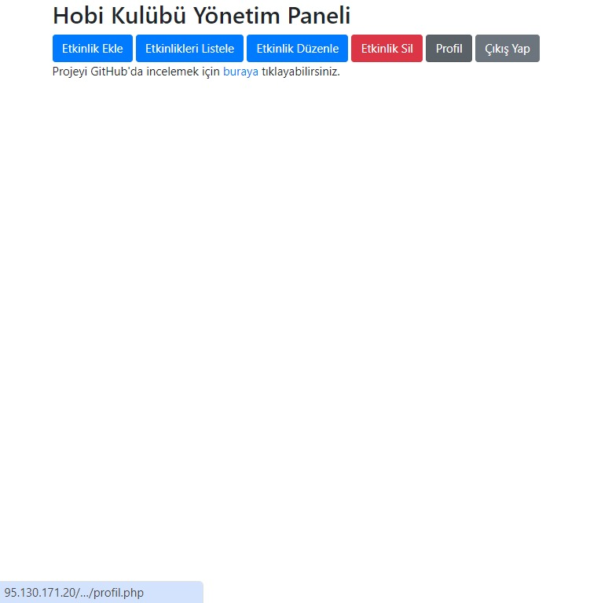

## Hobi Kulübü Yönetim Sistemi
### 1. Giriş
Hobi Kulübü Yönetim Sistemi, belirli bir hobiye (örneğin fotoğrafçılık, balıkçılık, bisiklet vb.) odaklanan bir kulübün etkinlik planlaması, üye yönetimi, ekipman paylaşımı ve bilgi alışverişi işlevlerini sağlayan web tabanlı bir uygulamadır.
Bu sistem, kulüp üyelerinin etkinlikleri kolayca planlamasına, yönetmesine ve üyeler arası iletişimi güçlendirmesine olanak tanır.

### 2. Kullanılan Teknolojiler
PHP: Sunucu tarafı programlama dili olarak kullanılmıştır.
MySQL: Veritabanı yönetim sistemi olarak kullanılmıştır.
HTML: Web sayfalarının yapısını oluşturmak için kullanılmıştır.
Bootstrap: Web sayfalarının stilini oluşturmak ve mobil uyumlu hale getirmek için kullanılmıştır.

### 3. Özellikler
#### Şifreli Giriş ve Oturum Yönetimi
Kullanıcılar, güvenli bir şekilde sisteme giriş yapabilir ve oturum açabilirler. Oturum açma işlemi sırasında kullanıcı adı ve şifre doğrulaması yapılır.

#### Bilgi Giriş ve Kaydetme
Kullanıcılar, sistemde çeşitli bilgileri (örneğin etkinlik bilgileri, üye bilgileri vb.) girebilir ve kaydedebilirler. Bu bilgiler güvenli bir şekilde veritabanında saklanır.

#### Girilen Bilgileri Listeleme
Kullanıcılar, daha önce girilen bilgileri listeleyebilir ve görüntüleyebilirler. Bu sayede, kulüp üyeleri etkinlikler ve diğer bilgiler hakkında kolayca bilgi sahibi olabilirler.

#### Girilen Bilgileri Silme
Kullanıcılar, gereksiz veya yanlış girilmiş bilgileri sistemden silebilirler. Bu işlem veritabanında saklanan bilgilerin güncel ve doğru kalmasını sağlar.

#### Girilen Bilgileri Düzenleme
Kullanıcılar, daha önce girilen bilgileri düzenleyebilirler. Bu sayede, değişen bilgiler güncellenebilir ve sistemdeki bilgiler her zaman güncel kalır.

### 4. Veritabanı Tasarımı
Veritabanı, aşağıdaki gibi bir yapı ile oluşturulmuştur:

USERS tablosu: Kullanıcı bilgilerini saklar. (User_ID, User_Name, E_Mail, First_Name, Last_Name, GSM_No, Birth_Date, Password)
Ekstra tablolar: Etkinlikler, ekipmanlar ve diğer kulüp bilgileri için benzer tablolar eklenebilir.

### 5. Kullanıcı Arayüzü
Kullanıcı arayüzü, Bootstrap kullanılarak oluşturulmuştur. Bu sayede, arayüz mobil uyumlu ve modern bir görünüme sahip olmuştur.
Kullanıcıların kolayca gezinebileceği ve işlemlerini rahatça gerçekleştirebileceği bir tasarım hedeflenmiştir.

### 6. Güvenlik
Kullanıcı şifreleri, PHP'nin password_hash fonksiyonu kullanılarak hashlenmiş ve güvenli bir şekilde saklanmıştır. Bu sayede, kullanıcı şifrelerinin güvenliği sağlanmıştır.
Ayrıca, oturum yönetimi için PHP oturumları kullanılmış ve kullanıcıların güvenli bir şekilde giriş yapması sağlanmıştır.
XAMPP Kurulumu ve Yapılandırması

### Hobi Kulübü Yönetim Sistemi'ni XAMPP üzerinde çalıştırmak için aşağıdaki adımları izleyebilirsiniz:

#### XAMPP'i İndirme ve Kurulum:

XAMPP'ı Apache Friends sitesinden indirin ve bilgisayarınıza kurun.

####  XAMPP'i Başlatma:

XAMPP Kontrol Panelini açın ve Apache ile MySQL servislerini başlatın.

#### Proje Dosyalarını XAMPP'e Taşıma:
Proje dosyalarınızı XAMPP'ın htdocs dizinine taşıyın. Örneğin, proje dizininiz hobi_kulubu ise, C:\xampp\htdocs\hobi_kulubu gibi bir yola kopyalayın.

#### Veritabanı Oluşturma ve Yapılandırma:
Web tarayıcınızda http://localhost/phpmyadmin adresine gidin.
phpMyAdmin anasayfasında, "New" sekmesine tıklayın ve kullanici_kayit adında yeni bir veritabanı oluşturun.
Yeni veritabanına tıklayın ve SQL sekmesine gidin. Daha önce sağladığınız Tabloya_Veri_Ekleme.sql dosyasındaki SQL komutlarını kopyalayın ve buraya yapıştırarak çalıştırın. 
Bu, gerekli tabloları oluşturacaktır.
Etkinlik tablosunu da eklemek için etkinlik.sql dosyasındaki SQL komutlarını kopyalayın ve SQL sekmesine yapıştırın.

#### Tarayıcıda Projeye Erişim:
Web tarayıcınızda http://localhost/hobi_kulubu/giris.php adresine giderek projeye erişebilirsiniz.
## Örnek Kod Görseli

* [Hobi Kulübü Uygulaması](http://95.130.171.20/~st22360859041/giris.php) - Bu linkten Host ettiğimiz hobi kulübü uygulamamıza ulaşabilirsiniz.
* * [Habi Kulübü Uygulaması Tanıtım Videosu](https://www.youtube.com/watch?v=pcRtn8Rx_kk&t=6s) - Programın çalışmasına gösteren örnek videoya da yandaki linkten ulaşabilirsiniz
